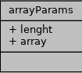
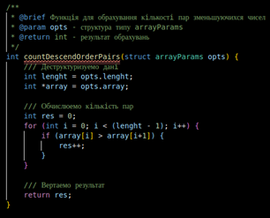
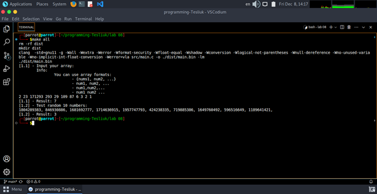

# Лабораторна робота №8.2. Вступ до документації проекту
[@Lordpluha](https://github.com/Lordpluha/)

## 1 Вимоги

### 1.1 Розробник

* Теслюк Владислав Андрiйович;
* студент групи КН-923г;
* 08-груд-23

### 1.2 Загальне завдання

Розробити  повноцінний  звіти  для  лабораторної  роботи  “Функції”,  що  присвячена  функціям у  двох форматів (+їх  репрезентація у PDF форматі):
- Markdown
- .doc  формат, згідно ДСТУ.

## 2 Опис програми

https://github.com/Lordpluha/programming-Tesliuk/tree/main/lab%2008

### 2.1 Функціональне призначення

Функція, що визначає, скільки серед заданої послідовності чисел таких пар, у котрих перше число менше наступного, використовуючи функцію з варіативною кількістю аргументів.

Наприклад, при вхідних даних { 3, 2, 4, 3, 1 }, результат повинен бути 3 (тобто наступні пари чисел: 3, 2, 4, 3, 3, 1)

#### Застосування

##### Формати вводу даних:
- {num1, num2, ...} <br>
- num1, num2, ... <br>
- num1, num2, ... <br>
- num1 num2 ... <br>

### 2.2 Опис логічної структури
Визначення структури передачі параметрів масиву між функціями



##### Поля даних
|  тип  |  назва  |
|:------|:------:|
| int   | lenght |
| int * | array  |

##### Детальний опис
Визначення структури передачі параметрів масиву між функціями 


#### Опис констант:
memorySize – константа що вiдображае кiлькiсть чисел для вводу

#### Функція перевiрки символа на цифру

```c
        bool isDigit(char myChar)
```

*Призначення*: Функцiя для перевiрки чи е символ цифрою.

*Опис роботи*: приймае символ, намагаеться конвертувати його в число, вертае boolean

**Аргументи**: 
- *myChar* – символ для перевiрки;

#### Функцiя для парсинга чисел в строцi в масив чисел

```c
        struct arrayParams stringToIntArray(char charArray[memorySize])
```

*Призначення*: Функцiя для парсинга чисел в строцi в масив чисел без зайвих символiв

*Опис роботи*: приймае строку, конвертуе, вертае структуру типу arrayParams

**Аргументи**: 
- *charArray* – строка для конвертацii;

#### Функцiя для вирахування кiлькостi пар зменьшуючихся чисел
```c
        int countDescendOrderPairs(struct arrayParams opts)
```

*Призначення*: Функцiя для вирахування кiлькостi пар зменьшуючихся чисел

*Опис роботи*: Приймае структуру типу arrayParams, обчислюе перебором массиву arrayParams.array, вертае число – результат програми

**Аргументи**: 
- opts – структура типу arrayParams – массив чисел;

#### Основна функція
```c
        int main() 
```
*Призначення*: головна функцiя (entry point) у програмi

*Опис роботи*: 
- Запит даних
- Перевiрка на заповненнiсть строки даними
- Обчислення результату за допомогою функцiй та возврат результату
- Тест з рандомними числами

#### Структура проекту

```
        └── lab 08
            ├── Doxyfile
            ├── Makefile
            ├── README.md
            ├── doc
            │   ├── assets
            │   ├── lab 08.docx
            │   ├── lab 08.md
            │   └── lab 08.pdf
            └── src
                ├── lib.c
                ├── lib.h
                └── main.c
```

### 2.3 Важливі фрагменти програми

#### Структура типу arrayParams
```c
        struct arrayParams {
            int lenght; ///< Довжина масиву
            int* array; ///< Вказiвник на массив
        };
```


#### Початкові дані. Константи, перерахування
```c
        /// Розмiр пам`ятi для програми
        #define memorySize 100
```
#### Обчислення кiлькостi зменьшуючихся пар чисел


## 3 Варіанти використання


## Висновки
При виконанні даної лабораторної роботи було набуто практичного досвіду роботи з документацiею коду.