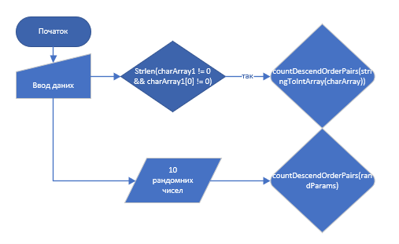
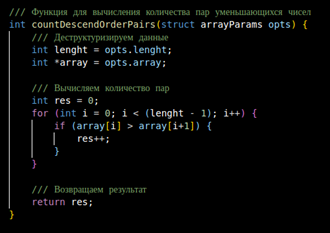

# Лабораторна робота №8.2. Вступ до документації проекту
[@Lordpluha](https://github.com/Lordpluha/)

## Вимоги
Розробник: Студент Теслюк Владислав Андрiйович, КН-923г, вiльний варiант, 08.12.23

## Загальне завдання
Розробити  повноцінний  звіти  для  лабораторної  роботи  “Функції”,  що  присвячена  функціям у  двох форматів (+їх  репрезентація у PDF форматі):
    - Markdown
    - .doc  формат, згідно ДСТУ.

## Опис програми
Код програми - https://github.com/Lordpluha/programming-Tesliuk/tree/main/lab%2008

## Призначення
Функція, що визначає, скільки серед заданої послідовності чисел таких пар, у котрих перше число менше наступного, використовуючи функцію з варіативною кількістю аргументів.
Наприклад, при вхідних даних { 3, 2, 4, 3, 1 }, результат повинен бути 3 (тобто наступні пари чисел: 3, 2, 4, 3, 3, 1)

## Застосування
### Формати вводу даних:  
•	{num1, num2, ...}  
•	num1, num2, ...  
•	num1, num2, ...  
•	num1 num2 ...  

## Опис логічної структури:

### Опис констант/функцiй:
 - memorySize – константа що вiдображае кiлькiсть чисел для вводу

 - struct arrayParams {
    int lenght;
    int* array;
}  - Структура для передачi даних через аргументи функцiй

 - bool isDigit(char myChar) - Функцiя для перевiрки чи е символ цифрою, приймае символ, вертае boolean

 - struct arrayParams stringToIntArray(char charArray[memorySize]) - Функцiя для парсинга чисел в строцi в масив чисел без зайвих символiв, приймае строку, вертае структуру типу arrayParams

 - int countDescendOrderPairs(struct arrayParams opts) - Функцiя для вирахування кiлькостi пар зменьшуючихся чисел, приймае структуру типу arrayParams, вертае число – результат програми

 - int main() – головна функцiя (entry point) у програмi
### Структура директрорiї:
.  
├── doc  
│   ├── lab 08.docx  
│   ├── lab 08.md  
│   └── lab 08.pdf  
├── Doxyfile  
├── Makefile  
├── README.md  
└── src  
    └── main.c  

### Важливі фрагменти програми:

 
> struct arrayParams stringToIntArray(char charArray[memorySize]) - Функцiя для парсинга чисел в строцi в масив чисел без зайвих символiв, приймае строку, вертае структуру типу arrayParams

## Варіанти використання:

## Висновки
Виконавши цю лабораторну роботу, я розробив  повноціннi  звіти  для  лабораторної  роботи  “Функції”,  що  присвячена  функціям у двох форматах(docx, md) (+їх  репрезентація у PDF форматі)

